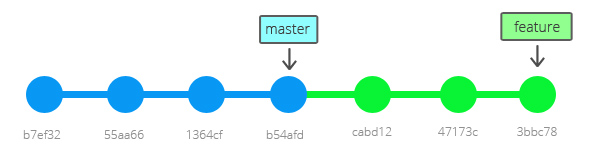

<p align="center">
  <h1 align="center" style="font-size: 4rem;">Git Training</h1>
  <p align="center" style="font-size: 1.5rem;">Manage your source code like a pro with best version control system!</p>
  <p align="center">
    <a href="https://git-scm.com"></a>
    <a href="https://www.mares.cz"></a>
  </p>
  <p align="center"><a href="https://www.mares.cz">Vojtěch Mareš</a> | <a href="mailto:vojtech@mares.cz">vojtech@mares.cz</a></p>
</p>

## Install Git

Download installer from https://git-scm.com or use package manager.

### macOS

```bash
brew install git
```

### Linux

```bash
# Debian/Ubuntu
apt install git

# Fedora and RHEL-family
dnf install git

# Alpine
apk add git
```

### Windows

```powershell
choco install git
```

## Basic configuration

I prefer global configuration (using --global) stored in your home directory
applied to all repositories, the global config is located at `~/.gitconfig`.

You can configure just one repo, you can call git config from you repository
with flag --local. Or edit `.git/config` file.

```bash
git config --global user.name "Vojtěch Mareš"
git config --global user.email "vojtech@mares.cz"
```

### Commit signing

To ensure the authenticity of commits and prove that the author is actually the
author and that the commits are not spoofed, consider signing commits with GPG
or SSH.

**GPG commit signing**:

```bash
# Tell Git, which GPG key to use
git config --global user.signingkey <key>

# Which program to use to sign commits and tags
git config --global gpg.program gpg

# Sign commits and tags
git config --global commit.gpgsign true
git config --global tag.gpgsign true
```

**SSH commit signing**:

```bash
# Tell Git to use SSH to sign commits and tags
git config --global gpg.format ssh

git config --global user.signingkey /PATH/TO/.SSH/KEY.PUB # Path is usually ~/.ssh/id_rsa.pub or id_ed25519.pub (depending on SSH key algorithm)
```

**Signed-off-by**:

From Git docs:

> Add a Signed-off-by trailer by the committer at the end of the commit log
> message. The meaning of a signoff depends on the project to which you’re
> committing. For example, it may certify that the committer has the rights to
> submit the work under the project’s license or agrees to some contributor
> representation, such as a Developer Certificate of Origin. (See
> https://developercertificate.org for the one used by the Linux kernel and Git
> projects.) Consult the documentation or leadership of the project to which
> you’re contributing to understand how the signoffs are used in that project.

```bash
git commit -s
git commit --signoff
```

### Rebase workflow (if you want to use rebase workflow)

**WARNING**: Apply only if you want to use rebase workflow!

```bash
git config --global pull.ff only
git config --global merge.ff only
git config --global pull.rebase true
```

## Git Editor

Git use by default Vim or editor from EDITOR environment variable. If you want
to use different editor, you can configure it.

```bash
git config --global core.editor emacs
```

You can use GUI editors like VS Code too:

```bash
git config --global core.editor "code --wait"
```

See Associating text editors with Git on GitHub Help to use your editor on your
platform.

## Git within your prompt

### Git PS1

If you want to see your branch in terminal prompt you have to use git-prompt.sh.

It works on Unix (ZSH & Bash). If you use Windows, it works by default in Git
Bash and there is no way how add it into CMD or PowerShell.

Install On Unix:

```bash
wget https://github.com/git/git/raw/master/contrib/completion/git-prompt.sh
mv git-prompt.sh ~/.git-prompt.sh
echo ". ~/.git-prompt.sh " >> ~/.bashrc
```

You have to add `__git_ps1` to your `PS1` variable.

Bash Example:

```bash
export PS1="\033[01;32m\]\u@\h\[\033[00m\]:\[\033[01;34m\]\w\[\033[00m\]$(__git_ps1)\$ "
```

Save it to .bashrc:

```bash
echo 'export PS1="\033[01;32m\]\u@\h\[\033[00m\]:\[\033[01;34m\]\w\[\033[00m\]$(__git_ps1)\$ "' >> ~/.bashrc
```

### Oh My ZSH

https://ohmyz.sh/

Git plugin is enabled by default, no need to configure anything. It is ready to
go.

Maybe configure a theme of your own choosing or create your own to suit all your
wishes.

## Aliases

You can create own git aliases:

```bash
git config --global alias.<alias> <command>
```

Examle:

```bash
git config --global alias.co checkout
git config --global alias.br branch
git config --global alias.cm commit
git config --global alias.st status
```

Usage of aliases is `git co` for `git checkout`, `git cm` for `git commit`, ...

Those aliases work on every platform (even Windows).

### My aliases

Saved inside global git config `~/.gitconfig`

```ini
[alias]
  fetch = fetch -p
  f = fetch -p
  m = merge
  mom = merge origin/master
  p = push
  pf = push --force-with-lease
  st = status -s
  sts = status
  cm = commit
  cma = commit --amend
  fixup = commit --fixup
  unstage = reset HEAD
  br = branch
  co = checkout
  rh = reset --hard
  rs = reset --soft
  stash = stash --keep-index
  wip = !git add $(git rev-parse --show-toplevel) && git commit -m WIP
  su = submodule update --recursive
  df = diff
  dfc = diff --cached
  dfs = diff --staged
  l = log --graph --decorate --pretty=oneline --abbrev-commit
  ll = log --graph --decorate --pretty=oneline --abbrev-commit --all
  ld = log -p
  ls = log --stat
  test = push -f origin HEAD:test
  selenium = push -f origin HEAD:selenium
  stats = shortlog -n -s --no-merges
  review = !git ld $1..HEAD --reverse
  rmb = !sh -c 'git push origin :$1' -
  rb = rebase
  rbi = rebase -i
  rbc = rebase --continue
  rba = rebase --abort
  rbs = rebase --skip
  rbo = rebase --onto
  rbom = rebase origin/main
  rbiom = rebase -i origin/main
  cp = cherry-pick
  optimize = !git prune && git gc --aggressive && git repack -a && git prune-packed
  fml = !git commit -m \"$(curl -s whatthecommit.com/index.txt)\"
  gone = "!git fetch --prune && git for-each-ref --format '%(refname) %(upstream:track)' refs/heads | awk '$2 == \"[gone]\" {sub(\"refs/heads/\", \"\", $1); print $1}' | xargs git branch -D"
```

E.g.: `git fml`

## Ignoring files

You can configure git to ignore files (or paths) using the `.gitignore` file.

Example:

```gitignore
vendor
phpstan-local.neon
**/some-random-file.txt # file with such name will be ignored in every directory
log
temp
www/assets/dist
```

### Keeping empty directories

This goes hand to hand with `.gitignore`, just add an empty `.gitkeep` file to
the directory you wish to keep.

```bash
touch directory-i-want-to-track-in-git/.gitkeep
```

### Default branch

A few years ago, GitHub and GitLab moved from `master` to `main` as the default
branch. If you create a repository locally, configure Git to create correct
default branch to save you some time.

```bash
git config --global init.defaultBranch main

git config --global init.defaultBranch master
```

## Editor behavior

This is not a git feature, but is really help full.

**EditorConfig!** Do not forget to commit it. `.editorconfig`

Example:

```editorconfig
root = true

[*]
indent_style = space
indent_size = 2
charset = utf-8
trim_trailing_whitespace = true
insert_final_newline = true
end_of_line = lf
max_line_length = off
```

The most important are `charset` and `end_of_line`. Since git is sensitive to
those and it is really great to unify this behavior, so you won't have to deal
with such issues in the future, for example related to `CRLF` vs `CR` vs `LF`
issues. Since this is a huge trouble when mixed.

I personally use and recommend `insert_final_newline` and
`trim_trailing_whitespace` set to `true`. It also helps with unifying the file
format.

`insert_final_newline` make diffs easier to read, since the previous line is not
modified (added new line).

There is a VS Code extension and Jet Brains plugin.

## Basic Commands

### `git init`

Initialize empty (with no history) Git repository in current working directory.

```bash
git init
```

### `git clone`

Clone a remote repository from remote server and work on it locally and then
push changes back to the remote repository.

For more see [Remote Repository (GitHub, GitLab)](#remote-repository-github-gitlab).

```bash
git clone <URL> [<target dir>]

# Clone via HTTPS
git clone https://github.com/vojtechmares/git-training.git

# Clone via SSH
git clone git@github.com:vojtechmares/git-training.git
```

### `git status`

Show status of repository. See which files are edited or want to be committed.

```bash
git status
```

Show all untracked files in status

```bash
git status --untracked-files=all
```

### `git add`

Add file to next commit

```bash
git add <path>
```

Examples

```bash
git add index.html
git add .
```

### Partial `git add`

You can use `-p` to switch into interactive mode and select part of changed
file, which you want to commit.

```bash
git add -p <path>
```

### `git diff` for new changes

You can see changes before `git add` or `git commit`.

See new changes in files managed by Git (not in new files):

```bash
git diff
```

If you want to see staged changes (added, prepared for commit), you have to use:

```bash
git diff --staged
```

### Unstage

Remove changes from next commit:

```bash
# Unstage all changes
git reset

# Unstage file
git reset -- <path>
```

### `git commit`

Save prepared changes to repository:

**Create commit from all staged changes**:

```bash
git commit
```

**Create commit form all changes (not new files)**:

```bash
git commit -a
```

**Commit one file (not new files)**:

```bash
git commit <file>
```

**Specify message in parameter instead of open vim**:

```bash
git commit -m "<message>"
```

**Combination of -a -m params**:

```bash
git commit -am "<message>"
```

How to write commit messages: https://cbea.ms/git-commit/

Commit messages and their format are explored later in chapter
[Conventional Commits](#conventional-commits).

**Update latest commit**:

```bash
git commit --amend
```

**Fixup**:

```bash
git commit --fixup
```

**Empty commit (no changes)**:

```bash
git commit --allow-empty
```

### `git log`

Show history of commits

```bash
git log
git log --oneline
git log --oneline --graph --all
```

### Browsing history

#### Tig

Simple terminal history browser for Git

##### Install

Mac

```bash
brew install tig
```

Linux

```bash
apt install tig
```

##### Usage

```bash
# only actual branch
tig

# all branches
tig --all
```

#### Gitk

Graphic commit log. Distributed with Git.

```bash
# only actual branch
gitk

# all branch
gitk --all
```

### Remote Repository (GitHub, GitLab)

If you have clonned repository, `git clone` has added configuration of
repository.

Check it by:

```bash
git remote -v
```

and you will see:

```bash
$ git remote -v
origin git@github.com:vojtechmares-training/example-repository.git (fetch)
origin
 git@github.com:vojtechmares-training/example-repository.git (push)
```

If you've created repository by `git init` you see nothing.

### Add Remote Repository

To add remote repository, you have to use:

```bash
git remote add <name> <url>
```

For example:

```bash
git remote add origin git@github.com:vojtechmares-training/example-repository.git
```

Now you can push & share your code with collaborators. Check `git remote -v`.

### Rename & Remove Remote Repository

If you want to rename remote repository, use:

```bash
git remote rename <name> <new name>
```

If you want delete remote, use:

```bash
git remote remove <name>
```

### Cleanup local branches which has remote deleted

```bash
git fetch --prune && git for-each-ref --format '%(refname) %(upstream:track)' refs/heads | awk '$2 == \"[gone]\" {sub(\"refs/heads/\", \"\", $1); print $1}' | xargs git branch -D
```

Or use an alias

```ini
[alias]
  # ...
  gone = "!git fetch --prune && git for-each-ref --format '%(refname) %(upstream:track)' refs/heads | awk '$2 == \"[gone]\" {sub(\"refs/heads/\", \"\", $1); print $1}' | xargs git branch -D"
```

Use like any other alias

```bash
git gone
```

### `git push`

Push your commits to remote repository (GitHub).

```bash
# Push new branch to repository
git push <remote> <branch> -u

# Push commit
git push
```

### `git pull`

Pull new commits from remote repository (GitHub).

```bash
git pull
```

### `git fetch`

Pull changes from remote repository without applying the changes.

```bash
git fetch
```

## Working with Branches

### Stash

Git stash is used for temporarily postpone your changes to make your working
directory clean.

That's required by some Git commands like `git rebase`, ... or sometimes for
`git checkout`, `git cherry-pick`, ...

If you want to stash changes, use:

```bash
git stash
```

And check status using `git status`.

If you want to see, which files are stashed, use:

```bash
git stash show
```

If you want to see patch, add `-p`:

```bash
git stash show -p
```

If you want to apply stashed changes and remove stash, use:

```bash
git stash pop
```

And check `git diff` and `git stash show`.

If you have multiple stashes you work only with the latest.

List all stashes:

```bash
git stash list
```

If you want to specify other stash you can use `stash@{0}`. For example:

```bash
git stash show stash@{1}
git stash show -p stash@{1}
```

More about stash in offical documentation - <https://git-scm.com/docs/git-stash>

### List Branches

```bash
# Show local branches
git branch

# Show all branches (with the branches of remote repository - on GitHub)
git branch --all
```

### Create a Branch

```bash
# Create branch (and dont switch to it)
git branch <new_branch> [<branch_from>]

# Switch branch
git checkout <branch>

# Create branch and switch to it
git checkout -b <new_branch> [<branch_from>]

# Create branch with switch and switch to it
git switch -c <new_branch>
```

### Switch Branch

```bash
git checkout <branch>

# switch
git switch <branch>
```

### Switch vs Checkout

Switch is new feature to Git, added after checkout.

Switch is designed only to switch between branches and/or create one. Meanwhile
checkout can do more. Switch is here to do only one thing.

### Push & Pull Branch

```bash
# Push commits to remote repository (GitHub)
git push <remote> <branch> -u

# Pull new commits to my branch
git pull
```

### Merging Branches

You can merge branches locally or on GitHub / GitLab using Pull / Merge
Requests.

#### Merge commits


### Rebase

A Czech article from [Ondrej Sika](https://ondrej-sika.cz): https://ondrej-sika.cz/git/rebase/



## Git Reset

Reset HEAD (current brach) to specific state.

Set HEAD to specific state, but don't change files in working directory.

```bash
git reset <commit>
```

If you want also reset files, use `--hard`:

```bash
git reset --hard <commit>
```

### Remove Last Commit

For example, you want to remove last commit but want to keep changes:

```bash
git reset HEAD~1
```

See `git status` and `git diff`, files from last commit are now in changed.

If you want remove last commit with its changes, use:

```bash
git reset --hard HEAD~1
```

If you want to reset to upstream master

```bash
git fetch
git reset --hard FETCH_HEAD
```

And see (`git status`, `git diff`), no changes.

### Interactive Rebase

Create some demo commits:

```bash
touch A
git add A
git commit -m A
touch B
git add B
git commit -m B
touch C
git add C
git commit -m C
touch D
git add D
git commit -m D
touch E
git add E
git commit -m E
touch F
git add F
git commit -m F
touch G
git add G
git commit -m G
touch H
git add G
git commit -m H
```

You rewrite history, join commits, update messages, reorder commits, ...

```bash
git rebase -i <ref>
```

Example:

```bash
git rebase -i HEAD~6
```

## Cherry Pick

Copy commit (ref) to actual HEAD.

```bash
git cherry-pick <ref>
```

Example:

```bash
git cherry-pick v1.0.x
git cherry-pick 47bdfb7
```

## `git reflog`

Reflog shows a history of refference. By default shows a `HEAD`. You can undo
any git operations even reset.

```bash
git reflog
```

```bash
git reflog <branch>
```

## `git tag`

Create tag:

```bash
git tag <tag> [<ref>]
```

Example:

```bash
git tag v1.0.0
git tag v1.0.0 HEAD~1
git tag v1.0.0 master
git tag v1.0.0 075615a
```

List tags:

```bash
git tag
```

Push tag:

```bash
git push <remote> <tag>
```

Example:

```bash
git push origin v1.0.0
```

Push all tags:

```bash
git push <remote> --tags
```

Example:

```bash
git push origin --tags
```

Delete tag (not recommended):

```bash
git tag -d <tag>
```

Example:

```bash
git tag -d v1.0.1
```

Delete tag from server:

```bash
git push <remote> :<tag>
```

Example:

```bash
git push origin :v1.0.2
```

## `git blame`

See authors of actual code

```bash
git blame <file>
```

See authors of code in specific revision

```bash
git blame <rev> <file>
```

See only lines from 1 to 10

```bash
git blame -L 1,10 <file>
```

## Submodules

Clone repository with submodules:

```bash
git clone --recursive <repo_url>
```

If you have cloned repository without `--recursive` you have to:

```bash
git submodule update --init
# for nested submodules
git submodule update --init --recursive
```

Add submodule to repository:

```bash
git submodule init
git submodule add <submodule_repo_url> [<path>]
```

Add submodule and track specific branch:

```bash
git submodule add -b <branch> <submodule_repo_url> [<path>]
```

Update tracked branch:

```bash
git submodule set-branch --branch <branch> <path>
```

Update remote repository:

```bash
git submodule set-url <path> <newurl>
```

Update submodule from remote repository

```bash
git submodule update --remote
```

Pull changes & pull submodules

```bash
git pull --recurse-submodules
```

Execute command for each submodule:

```bash
git submodule foreach 'git reset --hard'
# including nested submodules
git submodule foreach --recursive 'git reset --hard'
```

## Conventional Commits

[Conventional Commits](https://www.conventionalcommits.org/en/v1.0.0/) are an
opinionated way of writing commit messages.

Each commit message should adhere the following format:

```text
<type>[optional scope]: <description>

[optional body]

[optional footer(s)]
```

**Breaking changes**:

Breaking changes are marked with a `[type]` followed by exclamation (e.g. `feat!`
or with scope `refactor(api)!: remove v1`).

Or within `[body]` with `BREAKING CHANGE:` string.

Commit message example:

```text
refactor(api): remove v1

BREAKING CHANGE: This marks removal of REST API v1. Endpoints return **404 Not found** from now on.

[optional footer(s)]
```

Conventional Commits itself are quite minimalistic, common approach is to use
something like [Angular convention](https://github.com/angular/angular/blob/22b96b9/CONTRIBUTING.md#-commit-message-guidelines).

**Type**:

- **feat** - adding new features/functionality
- **fix** - fixing a bug
- **refactor** - refactoring existing code without a change of it's behavior
  (then it would be fix or feat)
- **chore** - no changes to the program (changes to editorconfig, updating
  dependencies (`chore(deps)`),...)
- **docs** - updating/adding to documentation including README
- **build** - changes to how program is build (e.g. `Dockerfile`)
- **ci** - GitHub Actions/GitLab CI/... changes to running tests, automated
  builds,...
- **style** - running a code formatter (`go fmt`, `terraform fmt`, Prettier,...)
- **test** - changes to program tests, but no changes to the program (e.g.
  faulty test)

_Types mentioned above are adopted from the Angular convention._

**Scope**:

Scope is optional information, like context. Providing additional information
from the commit message in simple and structured way.

### Semantic Versioning and Conventional Commits

Thanks to the Conventional Commits types, it is easy to programmatically
determine (generate) next version for [Semantic Versioning](https://semver.org/).

This eliminates debates on the topic of what the next version should be. But the
Conventional Commits must be followed thoroughly.

> [!NOTE]
> Given a version number MAJOR.MINOR.PATCH, increment the:
>
> MAJOR version when you make incompatible API changes
> MINOR version when you add functionality in a backward compatible manner
> PATCH version when you make backward compatible bug fixes
> Additional labels for pre-release and build metadata are available as extensions to the MAJOR.MINOR.PATCH format.

## Thank you! & Questions?

That's all, thank you for your attention.

Questions?

Let's go for a beer :beers:.

## Vojtěch Mareš

- email: [vojtech@mares.cz](mailto:vojtech@mares.cz)
- web: [mares.cz](https://www.mares.cz)
- x (twitter): [@vojtechmares_](https://x.com/vojtechmares_)
- linkedin: [/in/vojtech-mares](https://www.linkedin.com/in/vojtech-mares/)

Did you like the course? Tweet a recommendation on X (Twitter) and tag me
(`@vojtechmares_`) and/or add me on Linked In and I will send you a request for
recommendation. Thanks!
